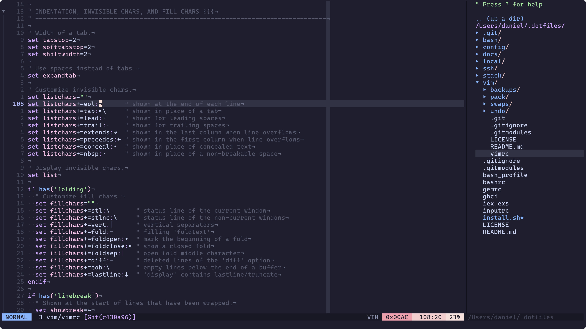

# Vim Config

My [Vim](https://www.vim.org) config.



## Installation

Clone this repo into `~/.vim` (or `~/.config/vim` if you're on 9.1.327 or later):

```
git clone https://github.com/unindented/vim-config.git ~/.config/vim
```

Then start Vim:

```
vim
```

## Meta

- Code: `git clone https://github.com/unindented/vim-config.git`
- Home: <https://github.com/unindented/vim-config>

## Contributors

Daniel Perez Alvarez ([daniel@unindented.org](mailto:daniel@unindented.org))

## License

Copyright (c) 2024 Daniel Perez Alvarez ([unindented.org](https://www.unindented.org/)). This is free software, and may be redistributed under the terms specified in the LICENSE file.
